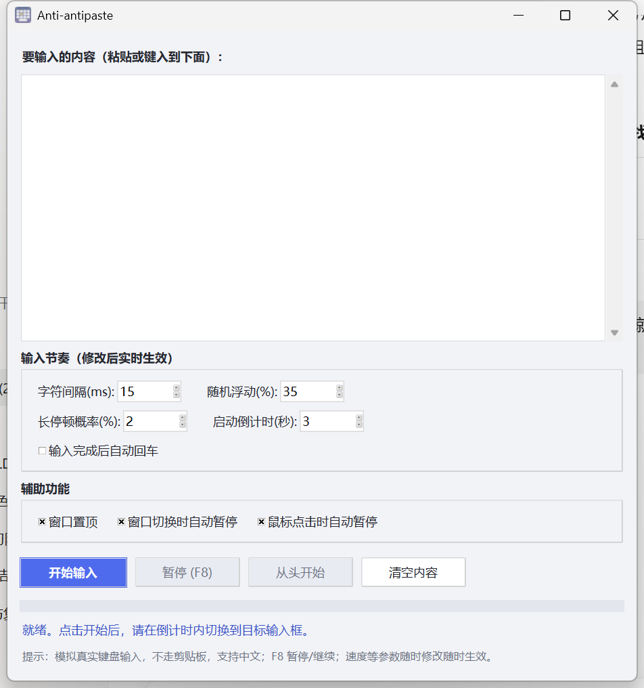

# Anti-antipaste

一个简单小巧的 Windows 小工具：把文本以"真人打字"的方式逐字模拟键盘输入，绕过禁止粘贴的输入框限制。



## 功能特性

- **模拟真实键盘输入**：逐字符注入键盘事件，不经过剪贴板，支持中文等 Unicode 字符
- **字符间隔可调**：5–2000 ms，默认 15 ms
- **拟人节奏**：随机延迟抖动 + 偶发"思考"长停顿，模拟真人打字
- **启动倒计时**：留出时间切换到目标输入框
- **窗口置顶**
- **自动暂停**：检测到前台窗口切换或鼠标点击时自动暂停（不会误触本工具自身按钮）
- **断点续输 / 从头开始**：暂停后可从断点继续，也可重新打
- **参数实时生效**：暂停时修改速度，点继续立即按新参数打
- **F8 全局热键**：暂停 / 继续
- 数字输入校验、高分屏 DPI 适配

## 下载

仓库内直接提供编译好的单文件版：[Anti-antipaste.exe](Anti-antipaste.exe)（打开后点右上角 **Download raw file**），双击即用，无需安装 Python 或任何依赖。

## 使用说明

1. 打开软件，把要输入的内容粘贴（或键入）到文本框
2. 按需调整输入节奏参数
3. 点击「开始输入」，在倒计时内点击目标输入框使其获得焦点
4. 输入过程中随时可按 **F8** 暂停 / 继续

> 如果目标环境检测较严格，建议把字符间隔调大（如 80–150 ms）、随机浮动调到 40% 以上，更像真人。

## 自行构建

```bash
pip install pynput pyinstaller pillow
python gen_icon.py        # 生成图标（icon.ico / icon.png）
pyinstaller --onefile --windowed --name Anti-antipaste --icon icon.ico --add-data "icon.ico;." --clean main.py
```

产物在 `dist/Anti-antipaste.exe`。

## 代码结构

| 文件 | 说明 |
| --- | --- |
| `main.py` | 入口与自检（`python main.py --selftest`） |
| `engine.py` | 打字引擎与全局热键 |
| `ui.py` | 界面（DPI 适配 + 样式） |
| `gen_icon.py` | 图标生成脚本（PIL 超采样绘制） |

## 运行环境

- Windows 10 / 11
- 源码运行：Python 3.10+，依赖 `pynput`

## 声明

本工具仅供学习交流，请遵守目标软件 / 平台的使用条款，勿用于违规用途。
